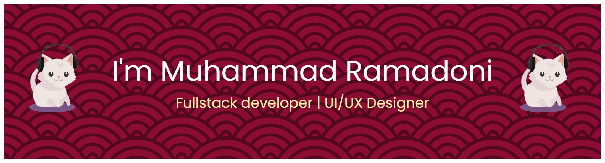

### Hi there 👋

<!--
**Muhramadoni/Muhramadoni** is a ✨ _special_ ✨ repository because its `README.md` (this file) appears on your GitHub profile.

Here are some ideas to get you started:

- 🔭 I’m currently working on ...
- 🌱 I’m currently learning ...
- 👯 I’m looking to collaborate on ...
- 🤔 I’m looking for help with ...
- 💬 Ask me about ...
- 📫 How to reach me: ...
- 😄 Pronouns: ...
- ⚡ Fun fact: ...
-->

#### 👋 About Me:

I am a **UI/UX Designer** and **Full-Stack Developer** with a strong focus on delivering intuitive, clean, and user-centered digital experiences. I am experienced in translating ideas into well-structured designs and functional applications by combining a refined visual sensibility with solid technical expertise. I place a high value on usability, consistency, and clarity in every product I develop, and I continuously explore modern design methodologies and web technologies to enhance the quality and impact of my work.

#### 🌐 Follow Me:

 

#### 💻 Tech Stack:

                      

#### 📊 GitHub Stats:  

 

#### 🎮 Play Game With Me:

<picture>
  <source media="(prefers-color-scheme: dark)" srcset="https://raw.githubusercontent.com/Muhramadoni/Muhramadoni/output/pacman-contribution-graph-dark.svg">
  <source media="(prefers-color-scheme: light)" srcset="https://raw.githubusercontent.com/Muhramadoni/Muhramadoni/output/pacman-contribution-graph.svg">
  
</picture>

###
